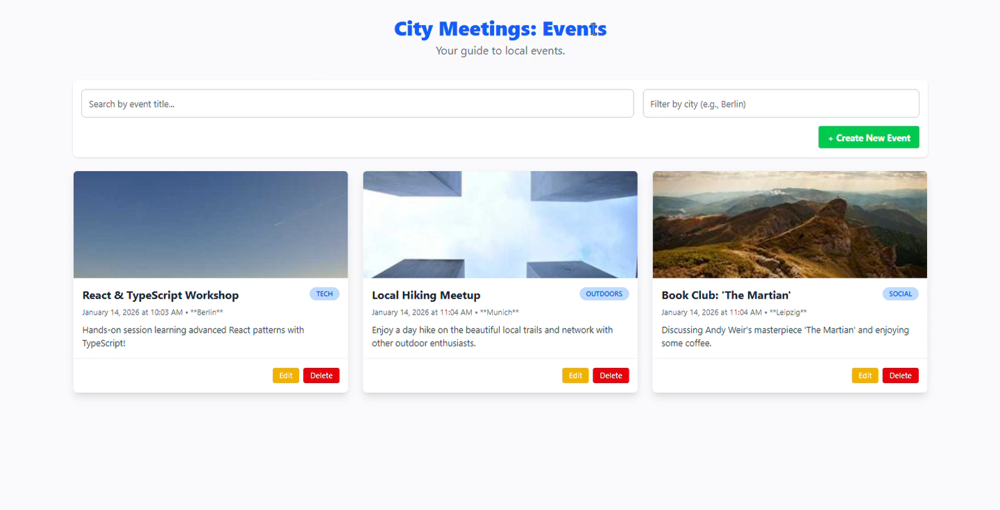
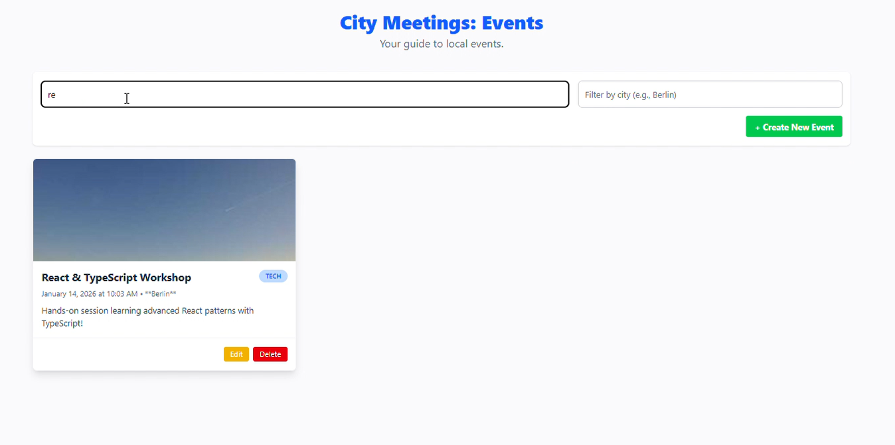
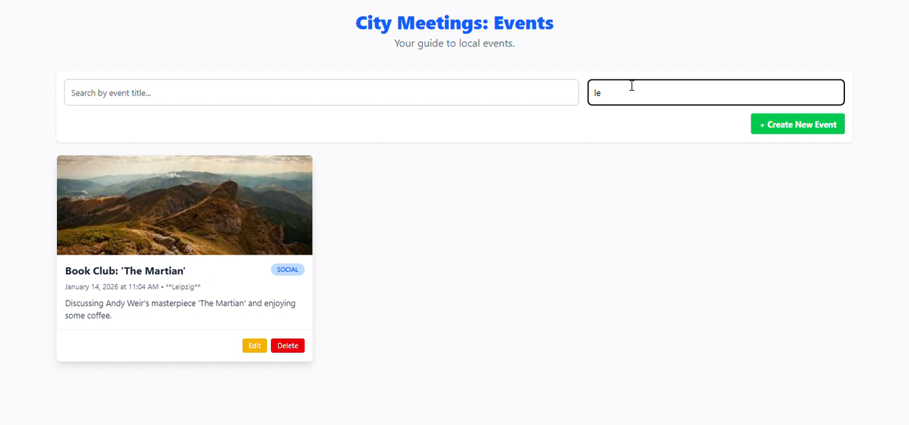
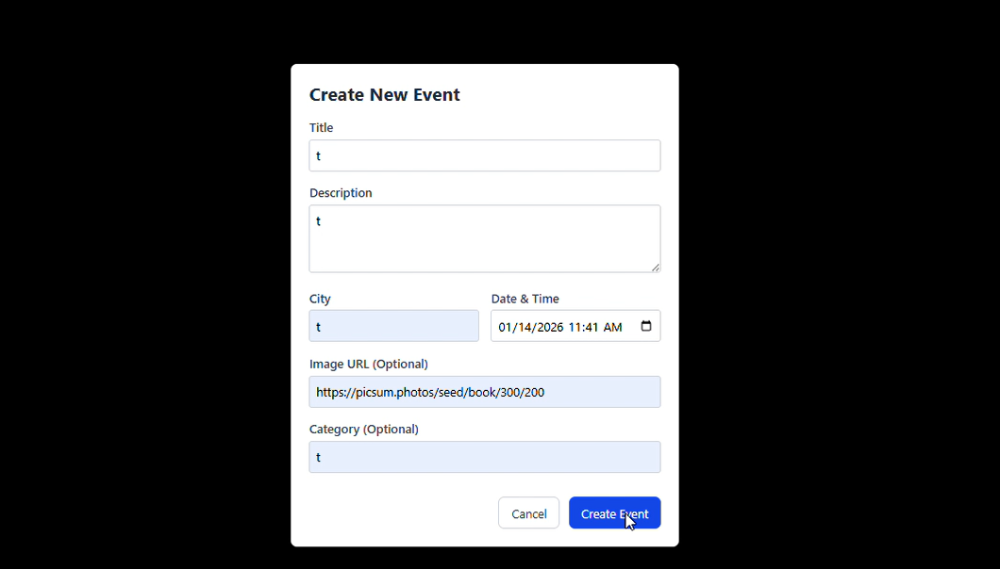
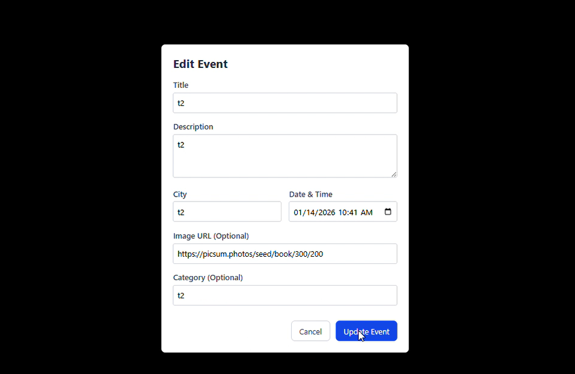
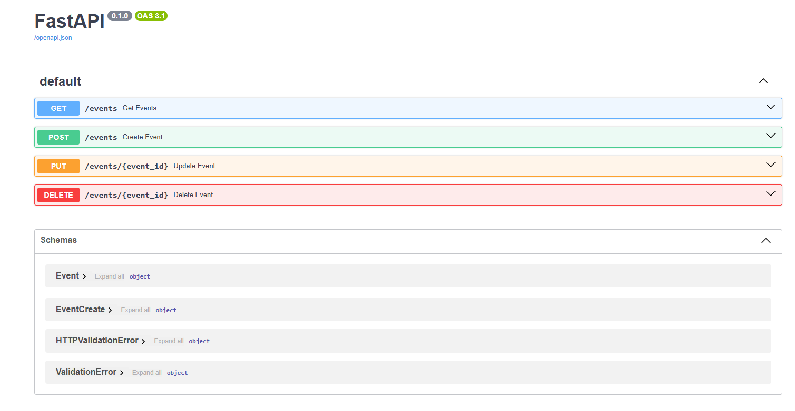

# 🏙️ City-Meet: Social Media Event Management App

**City-Meet** is a full-stack event management platform inspired by Meetup. It allows users to browse, search, and manage local events. This project demonstrates a modern decoupled architecture using a **React** frontend and a **Python FastAPI** backend with **Microsoft SQL Server** for persistence.

---

## 📂 Project Structure

The project is organized into two main directories to separate the client-side and server-side logic.

```text
City-Meet/
├── frontend/                # React + Vite + TypeScript
│   ├── src/
│   │   ├── components/      # EventCard, EventList, EventForm, SearchBar
│   │   ├── App.tsx          # Main state & API logic
│   │   └── types.ts         # TypeScript interfaces
│   └── package.json
│
└── backend/                 # Python FastAPI + SQLAlchemy
│    ├── main.py              # API routes & Entry point
│    ├── database.py          # MSSQL connection & Session config
│    ├── models.py            # SQLAlchemy database models (SQL tables)
│    ├── schemas.py           # Pydantic models (Data validation)
│    ├── requirements.txt     # Python dependencies
│
│── README.md     # App-specific notes
│── Tutorial.md  # Step-by-step guide
│── screenshots

```

<h2 id="screenshots">🖼️ App Screenshots</h2>

<p align="center">
  <b>Main Dashboard - Event List</b><br>
  
</p>

<p align="center">
  <b>Search and Filtering</b><br>
  
</p>
<p align="center">
  <b>Search and Filtering</b><br>
  
</p>

<div align="center">
  <table style="width:100%">
    <tr>
      <td align="center">
        <b>Create Event Form</b><br>
        
      </td>
      <td align="center">
        <b>Create/Edit Event Form</b><br>
        
      </td>
      <td align="center">
        <b>FastAPI Swagger Documentation</b><br>
        
      </td>
    </tr>
  </table>
</div>


---

## 🛠️ Tech Stack

* **Frontend:** React 18, TypeScript, Vite, Tailwind CSS
* **Backend:** Python 3.9+, FastAPI, SQLAlchemy ORM, Pydantic
* **Database:** Microsoft SQL Server (MSSQL)
* **Drivers:** ODBC Driver 18 for SQL Server, `pyodbc`

---

## 🚀 Getting Started

### 1. Database Setup (MSSQL)

1. Open **SQL Server Management Studio (SSMS)**.
2. Create a new database named `CityMeetDB`.
3. Ensure you have the **ODBC Driver 18 for SQL Server** installed on your machine.

### 2. Backend Setup (FastAPI)

1. Navigate to the `backend` folder:
```bash
cd backend

```


2. Create and activate a virtual environment:
```bash
python -m venv venv
# Windows:
.\venv\Scripts\activate

```


3. Install dependencies:
```bash
pip install -r requirements.txt

```


4. **Configure Connection:** Update the `SERVER` name in `database.py` to match your SQL Instance (e.g., `SERVER=F5;`).
5. Start the server:
```bash
python -m uvicorn main:app --reload

```


*Note: The server will automatically create the `events` table on its first run.*

### 3. Frontend Setup (React)

1. Open a new terminal and navigate to the `frontend` folder:
```bash
cd frontend

```


2. Install dependencies:
```bash
npm install

```


3. Start the development server:
```bash
npm run dev

```


---

## 🗄️ Backend Architecture Detail

To ensure scalability, the backend is split into specialized modules:

| File | Responsibility |
| --- | --- |
| **`database.py`** | Handles the `engine` creation and the `get_db` session dependency. |
| **`models.py`** | Defines the actual database schema using SQLAlchemy. |
| **`schemas.py`** | Defines how data should be shaped for requests/responses (Pydantic). |
| **`main.py`** | Contains the API endpoints and coordinates between models and schemas. |

---

## 📑 Project Phases

* [x] **Phase 1: Frontend UI** - Built the React interface with mock data and Tailwind CSS.
* [x] **Phase 2: REST API** - Created the Python backend using FastAPI and enabled CORS.
* [x] **Phase 3: Persistence** - Integrated SQLAlchemy ORM and connected Microsoft SQL Server.

---

## 📝 Key Features

* **Permanent Storage:** Events are saved in a relational SQL database.
* **Dynamic Filtering:** Search by event title or filter by city in real-time.
* **Full CRUD:** Create, View, Update, and Delete events via a clean UI.
* **Type Safety:** Uses TypeScript on the frontend and Pydantic on the backend to prevent data errors.

---

**Next high-value step:** Would you like me to show you how to add **Image Uploads** or **User Authentication** to the project?

## 🗄️ Database Connection Configuration

In **Phase 3**, the application transitions from in-memory storage to a persistent **Microsoft SQL Server** database. The connection is managed using **SQLAlchemy** and the **pyodbc** driver.

### Connection String Breakdown

The following configuration in `backend/database.py` defines how the Python API "shakes hands" with SQL Server:

```python
params = urllib.parse.quote_plus(
    r'DRIVER={ODBC Driver 18 for SQL Server};' # ODBC Driver for SQL Server should be installed 
    r'SERVER=SQLF5;' # YOUR_SERVER_NAME
    r'DATABASE=CityMeetDB;'
    r'Trusted_Connection=yes;'
    r'Encrypt=yes;'
    r'TrustServerCertificate=yes;'
)

```

| Parameter | Description |
| --- | --- |
| **`urllib.parse.quote_plus`** | Converts the connection string into a URL-encoded format that SQLAlchemy can process without errors. |
| **`DRIVER`** | Specifies the version of the driver installed on Windows. **Driver 18** is the modern standard for MSSQL. |
| **`SERVER=SQLF5`** | The name of your SQL Server instance. (Replace `SQLF5` with your local machine name if different). |
| **`DATABASE`** | The specific database container (`CityMeetDB`) where our tables are created. |
| **`Trusted_Connection=yes`** | Uses **Windows Authentication**. The app logs in using your current Windows session instead of a username/password. |
| **`Encrypt=yes`** | Required by Driver 18; it ensures data sent between the API and the DB is encrypted. |
| **`TrustServerCertificate=yes`** | Tells the driver to trust the local server certificate, preventing connection blocks during local development. |

### 💡 Why use an ORM?

Instead of writing raw SQL (e.g., `INSERT INTO events...`), we use **SQLAlchemy ORM**. This allows us to interact with the database using Python objects.

* **Automatic Schema Sync:** `models.Base.metadata.create_all(bind=engine)` automatically creates the `events` table in SSMS if it doesn't already exist.
* **Security:** It automatically prevents **SQL Injection** attacks by parameterizing queries.

---

### **Final Project Checklist**

1. **SSMS:** Ensure a database named `CityMeetDB` is created.
2. **Backend:** Run `python -m uvicorn main:app --reload`.
3. **Frontend:** Run `npm run dev` and verify that created events now appear in your SQL Server tables.


